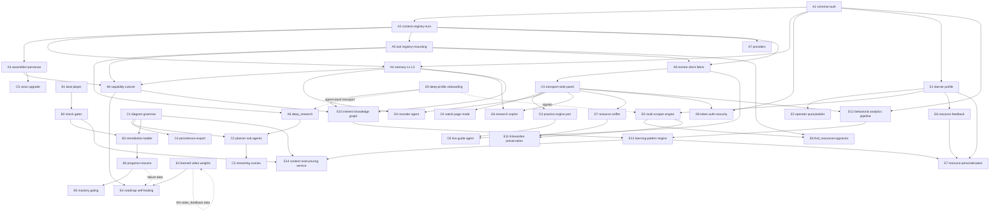

# Learning Dojo — Detailed Architecture Companion

> Companion to `architecture_masterplan.md` (phases/features) and
> `architecture_hypothesis.md` + `video_pipeline_hypothesis.md` (verified designs).
> Status: DRAFT for user approval. Claims grounded in those docs and in cloned-source
> scans (`agent-reach`, `linkwarden`, `wiki-graph`, `followme-extension`); speculation is
> marked **(proposed)**.

---

# 1. System Topology

```mermaid
graph TD
    subgraph EXT["Chrome Extension - Dojo Companion MV3"]
        SW["Service Worker<br/>auth token, duplex client,<br/>tab orchestration, offscreen doc"]
        SP["Side Panel UI<br/>guidance steps / chat / progress"]
        CS_YT["Content script: youtube adapter<br/>watch-page strip, transcript panel read"]
        CS_PLAT["Content script: platform linker<br/>deep-link handoff"]
        CS_ARXIV["Content script: arxiv adapter<br/>paper extractor, highlights"]
        CS_FIGMA["Content scripts: figma/docs adapters<br/>resolver stack, overlay, PassiveTracker"]
        REC["Recorder agent<br/>consent-gated action traces"]
        SNIFF["Resource sniffer<br/>webRequest pairing, WebVTT, MSE capture"]
    end

    subgraph NEXT["Next.js Platform"]
        subgraph BRAIN["src/lib/brain - brain core"]
            ORCH["Orchestrator<br/>startTurn facade"]
            REG["CapabilityRegistry<br/>manifests per capability"]
            LOOP["AgentLoop<br/>6-round budget, forced finish"]
            BUS["TurnBus<br/>typed TurnEvents + replay"]
            MOUNT["composeEnabledTools<br/>mounting policy pure fn"]
            TREG["ToolRegistry<br/>BaseTool, aliases, schemas"]
            PROV["ProviderLayer<br/>Gemini + Groq adapters, key pool"]
            MEM["Memory service L1/L2/L3"]
            PERS["Persona loader + Persona Studio"]
            SKILL["Skills manifest + read_skill"]
        end

        TURN["POST /api/turn<br/>SSE stream of TurnEvents<br/>capability param"]
        CLIENTREG["Client registry<br/>extension tabs as endpoints"]
        DUPLEX["Duplex channel<br/>SSE now, WS when needed"]
        APIR["Legacy/capability routes<br/>video-beats, practice-plan/outcome,<br/>feedback, get-transcript, upload-syllabus"]

        subgraph SB["Supabase"]
            T_AUTH["auth.users + RLS"]
            T_CTX["learning_contexts - L2 notebook"]
            T_MEM["memory_docs - L3 profile"]
            T_PERSONAS["personas"]
            T_VAULT["video_vault"]
            T_VFB["video_feedback"]
            T_BEATS["beat_progress"]
            T_PROG["user_progress - feynman_passed"]
            T_NODES["knowledge_nodes + node_edges"]
            T_NEXUS["nexus_cache"]
            T_RES["resources + pgvector embedding"]
            T_RFB["resource_feedback"]
            T_SIG["profile_signals"]
            T_PRAC["practice_plans + practice_outcomes"]
            T_EX["exemplar_store (proposed)"]
        end
    end

    subgraph EXTERNAL["External services"]
        GEM["Gemini API"]
        GROQ["Groq API"]
        YTAPI["YouTube Data API v3"]
        OEMBED["YouTube oEmbed liveness guard"]
        ARCLI["agent-reach CLI processes<br/>Reddit / X / YouTube / GitHub /<br/>LinkedIn / Bilibili / XiaoHongShu"]
        SCRAP["Scrapling sidecar<br/>python process, JSON over stdio/HTTP"]
        LW["Linkwarden instance<br/>REST API + API key"]
        WIKIG["wiki-graph CLI wg<br/>.wikg spine distillation"]
        JINA["Jina Reader via agent-reach web channel"]
    end

    %% UI edges
    WEBUI["Web UI: Workspace chat dock,<br/>Journey View, Whiteboard Studio,<br/>Resource Hub v2, NexusView"] -->|"fetch POST + SSE"| TURN
    SP -->|"user replies, ask_user answers"| SW
    SW <-->|"duplex TurnEvents SSE/WS"| DUPLEX
    DUPLEX --> TURN
    TURN --> ORCH
    ORCH --> REG
    REG -->|"capability.run"| LOOP
    LOOP --> BUS
    BUS -->|"SSE events"| WEBUI
    BUS -->|"TurnEvents"| DUPLEX
    MOUNT --> TREG
    TREG --> LOOP
    LOOP -->|"chatStream messages tools"| PROV
    PROV -->|"HTTPS streaming"| GEM
    PROV -->|"HTTPS OpenAI-compatible"| GROQ
    ORCH --> MEM
    ORCH --> PERS
    PERS -->|"eager block inject"| LOOP
    SKILL -->|"lazy manifest"| LOOP

    %% tool edges
    TREG -->|"find_video"| YTAPI
    TREG -->|"liveness check"| OEMBED
    TREG -->|"get_transcript"| APIR
    TREG -->|"reach_query spawn CLI"| ARCLI
    TREG -->|"find_resources crawl"| SCRAP
    TREG -->|"linkwarden_save REST"| LW
    TREG -->|"spine distill CLI"| WIKIG
    TREG -->|"read/write memory SQL"| T_MEM
    TREG -->|"L2 notebook SQL"| T_CTX
    TREG -->|"practice_emit SQL"| T_PRAC

    %% extension internals
    SW -->|"chrome.tabs messaging"| CS_YT
    SW -->|"chrome.tabs messaging"| CS_FIGMA
    SW -->|"chrome.tabs messaging"| CS_ARXIV
    CS_YT -->|"PLAYER_EVENT watch pct"| SW
    CS_FIGMA -->|"STEP_OUTCOME DOM_TRACE_BATCH"| SW
    CS_ARXIV -->|"PAGE_CONTEXT_UPDATE highlights"| SW
    REC -->|"normalized traces"| SW
    SNIFF -->|"MEDIA_CAPTURED"| SW
    SW -->|"telemetry POST"| APIR
    APIR -->|"SQL"| T_VFB
    APIR -->|"SQL"| T_BEATS
    APIR -->|"SQL"| T_SIG
    CLIENTREG -->|"session keyed routing"| SW
```



Transport legend: `HTTPS` = provider/Data-API calls · `SSE` = `/api/turn` event stream ·
`WS (proposed)` = extension duplex upgrade path · `chrome.tabs/SW messaging` = in-extension
IPC · `spawn CLI` = child-process invocation of `agent-reach` / `wg` binaries ·
`stdio/HTTP` = Scrapling sidecar JSON bridge (same pattern as the retired python
transcript bridge) · `REST` = Linkwarden API with API keys.

---

# 2. Brain Internals

## 2a. Capability → Tool Matrix

Mounting policy = `composeEnabledTools`: user toggles ∩ capability whitelist →
context-gated auto-mounts → capability-owned → always-on (A5). Persona defaults from
built-in dojo-mentor / peer / examiner loaders plus user-created personas (A3).

| Capability | Mounted tools | Auto-mount conditions | Persona default |
|---|---|---|---|
| tutor_chat | find_video, get_transcript, get_beats, read_memory, write_memory, read_skill, ask_user, search_web, reach_query, find_resources, whiteboard_render | reach_query when topic matches community-signal domains (Reddit/X); whiteboard_render when user asks "draw/explain visually"; get_beats when session bound to a long video | dojo-mentor |
| architect | search_web, reach_query, find_resources, read_memory, write_memory, read_skill, ask_user | reach_query for practitioner signals during skeleton validation; read_memory eager (profile + interest graph feed tailoring) | dojo-mentor |
| examiner | get_beats, read_memory, ask_user, practice_emit, whiteboard_render | get_beats auto-mounted when exam pulls failed beats as material (B5); deterministic spine forces grade call before verdict | examiner |
| nexus_curator | read_memory, reach_query, wiki_spine (proposed), read_skill | wiki_spine when distilling profile_signals into knowledge_nodes (E10, wiki-graph-style spine distillation) | peer |
| roadmap_surgeon | find_video, get_beats, read_memory, write_memory, ask_user | find_video on any chapter swap proposal; auto-mounts when E4 flags 👎×N module | dojo-mentor |
| conversation_guide | read_memory, ask_user, practice_emit | practice_emit when bound to an active PracticePlan session | peer |
| explain_board | whiteboard_render (owned), read_memory | always owns whiteboard_render; diagram-planner sub-agents run inside (C2) | dojo-mentor |
| deep_research | search_web, reach_query, find_video, get_transcript, find_resources, linkwarden_save, read_memory, write_memory, ask_user | full stack mounted by definition (A6); linkwarden_save archives every accepted source (E11) | dojo-mentor |

Always-on (all capabilities): read_skill manifest injection, ask_user availability.
Deferred/progressive disclosure applies to heavy tools (reach_query, find_resources)
per A5.

## 2b. Anatomy of one turn

Example: tutor_chat turn — *"explain kubernetes operators and find me a good video"*.

1. **Request parse** — `POST /api/turn {capability:"tutor_chat", message, sessionId,
   history}`. Route validates body, resolves sessionId (or mints UUID). *(Today the
   route accepts `mode`; A2 renames it to `capability`.)*
2. **Context build** — orchestrator builds `TurnContext`: history, tri-state
   enabledTools, persona_context, skills_manifest, metadata.waitForUserReply callback.
   Injection points:
   - **[L1]** working scratchpad assembled: current chapter/videoId, open questions,
     windowed prior tool results — always injected.
   - **[L2]** project notebook (`learning_contexts`) queried; injected only on topic
     match against highlights/notes.
   - **[L3]** durable profile (`memory_docs`) concatenated eagerly into the memory
     prompt block.
3. **Prompt assembly** — fixed block precedence (A3): general → policy → loop contract
   → capability playbook → persona → memory [L3 here] → tools → skills. Byte-stable
   system prompt; volatile seeds (search hints, L1 scratchpad) appended to the *user*
   message, never the system prompt.
4. **Provider stream round 1** — AgentLoop calls `provider.stream(messages, tools)`.
   Text deltas emit `CONTENT`; reasoning emits `THINKING`.
5. **Tool-call round** — model returns functionCalls instead of finishing. Each call
   emits `TOOL_CALL {name, args}`.
6. **Parallel dispatch** — calls executed concurrently, cap raised 4→8 (A5), dedupe +
   missing-arg guard. `find_video` runs Data-API-first search with VideoSpec bands;
   `get_transcript` hits the transcript route.
7. **functionResponse** — each result emits `TOOL_RESULT {name, content, sources}`;
   SOURCES event carries citation payloads; results appended as model/function parts.
8. **Round 2** — loop continues; this round has no tool calls ⇒ its streamed text IS
   the final answer (DeepTutor semantics).
9. **RESULT** — bus.result({finalText, rounds, toolSteps, cost_summary}) via
   emit_capability_result carrying {response, completed, engine stats, cost_summary}.
10. **DONE** — orchestrator guarantees terminal DONE even on ERROR paths.
11. **Memory writes** — post-turn: L1 discarded; salient facts → write_memory into
    `memory_docs` (L3); notes/highlights → `learning_contexts` (L2). *(Proposed:
    automatic extraction pass; v1 may rely on explicit write_memory tool calls.)*

Event firing map: SESSION at step 1 · STAGE_START/END around context build and any
capability stages · THINKING during provider reasoning · CONTENT deltas steps 4/8 ·
TOOL_CALL step 5 · TOOL_RESULT + SOURCES step 7 · RESULT step 9 · DONE step 10 ·
WAIT_FOR_INPUT whenever ask_user pauses (step 7 variant).

## 2c. Tool schemas

Owner column: **platform** = implemented server-side in Next.js routes/lib;
**extension** = dispatched via A9 command channel to a tab; **hybrid** = platform
orchestrates, extension executes.

| Tool | Description | Parameters (JSON-ish) | Owner |
|---|---|---|---|
| find_video | Scored YouTube search honoring chapter VideoSpec bands; supports exclusion ids for 👎 swaps | `{query, targetDurationBand?: "short"\|"medium"\|"long", expectedMinutes?: [min,max], language?, excludeIds?: string[], depth?}` → `{videoId,score,reason}[]` | platform |
| find_resources | Non-video resources (docs/repos/papers/interactive) via Scrapling allowlist + sniffer merge; pgvector semantic match; judge-scored | `{concept, resourceTypes?: string[], level?, language?, limit?}` → `{resourceId,score,reason}[]` | platform |
| get_transcript | Transcript text for a videoId (multi-provider forge w/ circuit breaker) | `{videoId, lang?}` → `{text, source, segments?}` | platform |
| get_beats | Beat windows + check results for a long video | `{videoId}` → `{beats:[{index,startSec,endSec,title,checkType}], masteryPct}` | platform |
| read_memory | Read L3 profile docs (concat-on-inject semantics) | `{scope?: "preferences"\|"style"\|"goals", query?}` → `{docs: string[]}` | platform |
| write_memory | Persist a durable preference/fact to L3 | `{kind, content, confidence?}` → `{ok, docId}` | platform |
| read_skill | Lazy-load a skill body from the manifest | `{skillName}` → `{body}` | platform |
| ask_user | Pause turn awaiting user reply (WAIT_FOR_INPUT, not terminate) | `{question, options?: string[], timeoutSec?}` → `{reply}` | platform |
| search_web | General web search (Exa via agent-reach MCP / Jina Reader fallback) | `{query, maxResults?}` → `{title,url,snippet}[]` | platform |
| reach_query | Fan out to agent-reach CLI channels: Reddit threads, X posts, GitHub, LinkedIn public pages, Bilibili, XiaoHongShu | `{channel: "reddit"\|"twitter"\|"github"\|"linkedin"\|"youtube"\|"bilibili"\|"xiaohongshu", action: "search"\|"read", target, limit?}` → normalized items | platform (spawns CLI) |
| linkwarden_save | Archive a URL in self-hosted Linkwarden with tags/annotation; dedupe vs vault | `{url, tags?: string[], note?}` → `{linkwardenId, archived}` | platform |
| whiteboard_render | Emit typed draw commands for a concept chunk via diagram-planner pipeline | `{topic, diagramType?: "flowchart"\|"sequence"\|"comparison"\|"timeline"\|"state"\|"mindmap"}` → streams NARRATION + DRAW_DELTA | platform |
| practice_emit | Write a practice/mastery datapoint (step outcome, remediation rung) | `{planId, stepIndex, outcome, latencyMs?, hintLevel?}` → `{ok}` | hybrid (extension reports, platform writes) |
| guidance_command | Send one A9 command to a bound tab (used by GuideAgent loops) | `{tabClientId, command, payload}` → `{ack}` | hybrid |

## 2d. Deep research fan-out

`deep_research` (A6) runs one orchestrating AgentLoop that spawns bounded parallel
sub-loops, each a specialist with its own small round budget and tool whitelist:

1. **scout** decomposes the question into 3–6 sub-questions + success criteria.
   Input: raw question + L3 profile. Output: research plan (STAGE_START `scout`).
2. Nine specialists run as parallel bounded sub-loops (each ≤3 rounds, ≤4 tools):
   - **source-hunter**: inputs = sub-questions; outputs = web/doc citations; uses
     search_web + **reach_query** (Reddit threads, X posts — real practitioners'
     opinions).
   - **video-scout**: Data API multi-query fan-out per sub-question → candidate pools.
   - **transcript-miner**: inputs = winning videoIds; outputs = evidence excerpts.
   - **resource-curator**: Scrapling allowlist crawl + cat-catch-compatible rules →
     Resource objects; reach_query for community-curated lists.
   - **gap-analyzer**: inputs = merged findings-so-far; outputs = missing angles →
     follow-up queries fed back to scout (one feedback cycle max).
   - **outline-architect**: teaching order over validated findings.
   - **critic**: fact-check/contradiction pass over all claims; flags unsupported ones.
   - **synthesizer**: merges into cited brief.
   - *(ninth slot)* **cost/budget auditor (proposed)**: tracks spend, enforces caps —
     masterplan says "8–9 specialists"; the ninth is either gap-analyzer split or this.
3. **Merge/critic ordering**: synthesizer output passes through critic before RESULT;
   critic vetoes become gaps, not silent drops.
4. **Streaming**: every specialist emits THINKING/SOURCES/STAGE events tagged with its
   name so the UI shows live fan-out progress.
5. **Cost caps**: global per-turn budget (rounds × specialists), daily learner budget
   (Phase F quota discipline), hard cap on reach_query spawns and Data API units
   (~100 free searches/day). Result = cited brief + sources + gaps → optional
   auto-roadmap patch proposal handed to architect/roadmap_surgeon.

---

# 3. Feature Pairing Map

| Feature | Platform component(s) | Pairs-with (consumes ⇄ exposes) | Activation trigger in user flow |
|---|---|---|---|
| A1 schema+auth | Supabase migrations, Supabase Auth, RLS | consumes: nothing · exposes: user_id threading to ALL features below | sign-in gate on first load |
| A2 UnifiedContext+registry+/api/turn | brain core, TurnBus, orchestrator | consumes A1 · exposes: single SSE entry point for every capability & client | any AI interaction |
| A3 prompt assembler+personas+Persona Studio | assembler.ts, personas table, chat dock selector | consumes A2 · exposes: tone+voice to explain_board C5, examiner | persona switch in dock |
| A4 memory L1/L2/L3 | memory service, learning_contexts, memory_docs | consumes A1,A2 · consumed by: all capabilities, D4 recorder, D6 copilot, E10 graph | automatic per-turn |
| A5 ToolRegistry+mounting | registry.ts, compose.ts | consumes A2 · consumed by A6, A8, A9 guide agents | every turn |
| A6 deep_research | 9-specialist fan-out | consumes A5, E9 agent-reach · exposes briefs to architect, E4 | "research X" request in dock |
| A7 providers | gemini.ts+groq.ts ChatProvider | consumes A2 · consumed by everything | transparent |
| A8 capability cutover waves | tutor_chat/architect/examiner/nexus_curator/roadmap_surgeon/conversation_guide | consumes A3–A5 · deletes 8 legacy routes | respective UI surfaces |
| A9 remote client fabric | client registry, duplex channel, GuideAgent loops | consumes A2,A5 · foundation for D1,D3,D5 | extension connects |
| B1 beat player | player seek/sync | consumes shipped beats API · pairs B2 | open long-video chapter |
| B2 check gates | quiz/summary/flowchart/minigames | consumes B1 · exposes fail events to B3 | beat end pause |
| B3 remediation ladder | hint→whiteboard→recap→alt-video | consumes B2, C1–C3 whiteboard, M5 | check failure |
| B4 progress/resume/spaced-rep | beat_progress table | consumes B3, A1 · exposes failed-beat queue to B5, E4 | next session start |
| B5 mastery gating | feynman_passed wiring in user_progress | consumes B4, A8 examiner · locks modules | journey completion |
| C1 diagram grammar | templates+layout engine | consumed by C2, B3, explain_board | whiteboard turns |
| C2 planner sub-agents | chunker→type-selector→layout→drawer→critic | consumes C1, A6 pattern | explain_board turn |
| C3 streaming scenes | scene-by-scene NARRATION+DRAW_DELTA | consumes C2 | live board |
| C4 persistence/export | saved boards, PNG/SVG | consumes C1 · writes L2 exports (A4) | save/share |
| C5 voice upgrade | voice selection per persona | consumes A3 | studio settings |
| D1 transport+Side Panel port | duplex channel, panel UI | consumes A9 · consumed by D2–D7 · **cross-platform telemetry**: every extension surface streams PLAYER_EVENT/PRACTICE_OUTCOME/PAGE_CONTEXT into the central analytics pipeline (E12) so off-platform learning counts | extension connect |
| D2 watch-page mode | youtube CSS strip content script | consumes D1 · feeds PLAYER_EVENT to video_feedback | raw YouTube link click |
| D3 practice engine port | FolloMe resolver stack ~1.5k LOC + 200-line controller | consumes D1, A9 · exposes STEP_OUTCOME to D5, practice_emit | implementation-depth chapter |
| D4 recorder agent | consent-gated trace capture | consumes D1, A4 · writes L2 entries + exemplar_store | managed session toggle ON |
| D5 live guide agent | brain-spawned GuideAgent per tab | consumes A9, D3 · drives overlay/hints | practice session active |
| D6 research copilot | arXiv extractor + walkthrough | consumes D1, A4 · highlights→L2 | arXiv page open |
| D7 resource sniffer | cat-catch-lineage capture | consumes D1 · feeds E5/E8, E11 archive | lecture page media detected |
| D8 token auth+security | platform tokens, MV3 lifecycle fix | consumes A1, D1 | extension pairing |
| D9 universal bookmarking + native import | Save-to-Dojo extension action + context menu, Resource Hub entries (Linkwarden archive behind it), embedded-media import pipeline | consumes D7 sniffer, E6 resource_feedback tagging · exposes imported third-party videos as NATIVE beats/mastery journeys (B1–B5) instead of sending users elsewhere | one-click "Save to Dojo" on any page/PDF/paper; sniffed third-party video imported |
| D10 practice-site selector agent | brain agent scoring context-extractor output (interactive elements, canvas-heaviness, login state) vs active chapter goals, generic fallback adapter | consumes A9, D3 · proactively offers "you could practice X right here" on ARBITRARY sites, not just curated ones | page context scored against active chapter goals |
| E1 learner profile | onboarding v2, profile table | consumed by E2 judge, E7, personas | onboarding |
| E2 operator QueryBuilder | dual-artifact queries | consumes E1 · feeds find_video, E5 | every search |
| E3 learned video weights | nightly SQL aggregation | consumes M4 video_feedback data · feeds rubric | nightly job |
| E4 roadmap self-healing | 👎×N flags, remedial proposals | consumes E3, A8 architect | repeated dislikes/failures |
| E5 multi-scraper engine | Scrapling sidecar + recipes | consumes E1 · feeds E8, D7 merge | resource lookup |
| E6 resource feedback | resource_feedback table + card UI | consumes A1 · feeds E7 | 👍/👎/bookmark on hub card |
| E7 resource personalization | type/domain weights | consumes E6, E1 · orders find_resources + hub | ranking time |
| E8 find_resources+semantic match | pgvector tool | consumes E5, A5 | mid-turn brain call |
| E9 deep-profile onboarding | GitHub/LinkedIn/YouTube connectors, agent-reach, profile_signals | consumes agent-reach · feeds E10, A6 specialists | optional "connect more of you" step |
| E10 interest knowledge graph | knowledge_nodes/node_edges + wiki-graph spine distillation | consumes E9, A4, A8 · consumed by architect/examiner/E7/persona inference | after signal ingestion |
| E11 Linkwarden preservation | Linkwarden API integration | consumes E5, D7 · reads annotations back to L2 | every captured resource |
| E12 behavioral analytics pipeline | unified `analytics_events` stream + sessionizer (start/end/pause/resume/return-rate), click-path capture per lesson | consumes A1, D1 telemetry from every surface (platform clicks/navigation/session boundaries; extension watch-%/practice outcomes/pauses/abandonment) · feeds E13 · privacy-scoped: consent toggle, no keystrokes | any platform or extension interaction, once consent granted |
| E13 learning-pattern engine | aggregation of E12 + beat/practice results into the central user persona; stuck-question clustering vs excel-zones; Patterns Dashboard | consumes E12, E10 interest graph · emits pattern signals consumed by E7 ranking weights, E4 remediation proposals, examiner difficulty tuning, and the E14 restructuring trigger | after analytics sessions accumulate |
| E14 content restructuring service | fetch/analyze external material → reformat into personal learning style (native beats journey at their pace, whiteboard explainer of hard segment, simplified-language summary, video→docs format swap); restructured version stored alongside original with provenance | consumes E13 trigger signals, B2 check gates, C1 diagram grammar | learner struggles with EXTERNAL content: low watch-% on imported video, repeated fails on restructured checks, or explicit "explain simpler" |

Shared seams: **A9 fabric** (D-phase backbone), **A4 memory** (everything reads/writes
it), **E9 signals store** (feeds graph, personalization, research).

---

# 4. User Workflow Narratives

## J1 — First-run + optional profile onboarding

1. User → opens app unauthenticated → redirected to sign-in (A1 Supabase Auth).
2. System → creates profile row; default dojo-mentor persona active (A3).
3. User → onboarding v2: role/level/language/goals → written to profile (E1) and L3
   memory_docs via write_memory.
4. User → optional "Connect more of you" (E9): clicks GitHub connector.
5. System → spawns `agent-reach` GitHub channel (`gh repo view`/search) → repos,
   languages, stars → skill-map signals → `profile_signals` rows.
6. User → opts into LinkedIn → system runs agent-reach linkedin channel (public page
   reader: Jina Reader fallback) → career/skills signals → profile_signals.
7. User → opts into YouTube self-data → OAuth watch-history import (or yt-dlp local
   playlist import) → profile_signals.
8. System → archives every ingested source URL via linkwarden_save (E11) for permanent
   exportable library.
9. System → nexus_curator distills signals + wiki-graph-style spine distillation into
   knowledge_nodes/node_edges (E10); persona inference may suggest "hands-on DevOps
   learner".
10. Skip path: user clicks "skip" at any connector → default persona, empty graph,
    zero signals stored; nothing mandatory.

## J2 — Learn a chapter end-to-end

1. User → enters topic "Terraform" → architect capability generates roadmap
   (topology→research→skeleton→validate spine, A8) with VideoSpec per chapter (ADR-V2).
2. System → for chapter 1, find_video tool: QueryBuilder dual-artifact (E2) → Data API
   search with duration band → rubric score → scored LLM judge `{videoId,score,reason}[]`
   → winner + alternatives rendered with judge badges.
3. User → opens chat dock, asks questions → tutor_chat turn; get_transcript grounds the
   answer; L1/L2/L3 injected per layer policy (2b).
4. User → dislikes the pick ("too advanced") → video_feedback row → cache bust →
   find_video re-runs with excludeIds + reason folded into query expansion → new pick
   streams into same UI, no reload (fast-path swap).
5. System → dislike counted toward E4 module flagging (👎×2 same module → regeneration
   proposal card).

## J3 — 7-hour mastery journey

1. System → beats API splits 7h video into 8–12 min windows with checks (shipped).
2. User → starts journey; embedded player seeks to beat.startSec (B1); current-beat
   highlight rail syncs playback.
3. System → at beat end pauses → check gate (B2): flowchart reconstruction for this
   beat — learner places nodes, connects edges, validated vs gold graph.
4. User → fails twice.
5. System → remediation ladder (B3): inline hint → auto explain_board turn scoped to
   THAT beat's transcript → whiteboard re-explains with typed diagram grammar (C1–C3),
   streamed scene-by-scene → micro-recap clip (beat summary TTS) → alternative-video
   fallback offer.
6. User → retries reconstruction → passes → beat_progress records attempts, score,
   remediation used (B4).
7. User → closes browser mid-journey.
8. System → next session: resume banner restores exact beat; two previously failed
   beats resurface via spaced-repetition queue (B4).
9. System → journey completion feeds examiner state; Feynman gate (A8) blocks module
   advance until feynman_passed; examiner can pull any failed beat as exam material
   (B5).

## J4 — Deep research request

1. User → dock: "compare terraform state backends — what do practitioners say?"
2. System → /api/turn capability=deep_research → scout decomposes into sub-questions
   (S3 locking backends vs remote, consensus tradeoffs, migration stories).
3. System → nine specialists fan out (2d): source-hunter runs reach_query on Reddit
   r/Terraform threads + X posts for practitioner war stories; video-scout multi-query
   Data API; transcript-miner extracts evidence; resource-curator crawls HashiCorp docs
   via Scrapling; gap-analyzer requests one more angle (S3 lockfile conflicts).
4. System → critic fact-checks claims, flags contradictions; synthesizer merges cited
   brief; STAGE/SOURCES events stream live per specialist.
5. System → RESULT: cited brief + sources + gaps; every accepted source linkwarden_save'd
   (E11); optional patch proposal: "add a migration chapter?" → user accepts →
   roadmap_surgeon patches plan.

## J5 — Extension-guided practice in Figma

1. System → implementation-depth chapter emits PracticePlan (ordered steps, anchor
   chains data-testid→aria-label→text-anchor→CSS path→region fingerprint, hint ladder).
2. Extension → opens Figma in managed tab; Side Panel (ported FolloMe panel, D1) shows
   step k/N.
3. Brain → GuideAgent spawned bound to tab (A9/D5) → sends execute_guidance_step
   command; content script resolves target via resolver stack (ElementMatcher
   +50 text/+30 type/+20 aria, RecoveryEngine tiers), overlay draws ghost cursor +
   dashed bbox (FolloMe overlay.js lineage).
4. Extension → PassiveTracker watches completion via capture-phase passive listeners;
   canvas-heavy detection flips to CDP Input.dispatchMouseEvent observation.
5. User → stalls >N sec → GuideAgent escalates hint ladder: nudge → explain → show-me.
6. User → completes step → STEP_OUTCOME{status:complete} → GuideAgent advances plan;
   drift detected → RecoveryEngine re-resolves without losing plan position
   (DOMStabilityMonitor threshold 30, SyncController version-checked).
7. System → practice_emit writes outcomes; D4 recorder (consent ON) normalizes the
   click/input trace into L2 notebook entry "user did X in Figma" + exemplar_store row.
8. Session ends → Side Panel state done; Trace Viewer shows what was remembered, with
   delete affordance.

## J6 — arXiv Research Copilot session

1. User → opens arXiv paper → arxiv adapter extracts title/abstract/sections/figures
   (Readability fallback) → PAGE_CONTEXT_UPDATE.
2. Side Panel → section-by-section walkthrough (tutor_chat bound to paper context);
   grounded Q&A: "what does §3 assume?" answered with section text injected.
3. User → highlights a passage + adds note → synced to L2 notebook (learning_contexts)
   as arXiv annotation (A4/D6).
4. System → linkwarden_save archives the paper with tags; annotations read back into
   L2 on return visits (E11).
5. System → paper entities distilled via wiki-graph-style spine pass into knowledge
   graph nodes (E10); reading telemetry feeds mastery signals.

## J7 — Resource feedback shaping rankings

1. User → Resource Hub v2 sees blog post ranked #2 for "kubernetes operators".
2. User → clicks 👎 with reason chip "off-topic" → POST mirrors /api/feedback contract
   → resource_feedback row {signal:dislike, domain, resource_type} (E6).
3. System → invalidates cached resource; records type/domain preference decrement.
4. System → aggregation job updates per-learner TYPE weights (prefers docs over blogs)
   + DOMAIN priors (random blogs demoted, MDN trusted) (E7).
5. Future → find_resources judge-style scoring reorders; Hub shows "because you prefer
   docs" ordering indicator; the disliked URL never resurfaces for this learner while
   global results stay unfiltered (ADR-V3 mirror).

## J8 — External content struggle → native restructured journey

1. User → finds a great third-party lecture video elsewhere → one-click "Save to Dojo"
   (D9) → sniffer pulls the embedded media into the platform for NATIVE viewing →
   instantly eligible for the full beats/mastery journey (B1–B5).
2. User → starts watching natively; extension/platform surfaces stream
   WATCH_PROGRESS/SESSION_BOUNDARY events (D1 telemetry) into the `analytics_events`
   pipeline (E12).
3. System → E12 sessionizer computes a low watch-% signal on the imported video
   (abandonment at ~40%, repeated pauses in one segment).
4. System → E13 pattern engine aggregates the signal with beat/practice history and
   flags it as an external-content struggle pattern (stuck-zone vs excel-zone).
5. System → E13 fires the restructuring trigger → E14 fetches/analyzes that material
   (transcript/article text via transcript forge / Scrapling).
6. System → E14 reformats into the learner's personal style: native beats journey at
   their pace + whiteboard explainer of the hard segment (C1–C3 diagram grammar) +
   simplified-language summary; alternative-format swap (video→docs) offered per E7
   type weights.
7. User → resumes the restructured version NATIVELY — beat-synced player, check gates,
   remediation ladder — while the original stays stored alongside with provenance.

---

# 5. Extension Contract (the A9 fabric)

Design stance (masterplan Phase D): the extension is NOT a telemetry sender — it is a
remote endpoint the brain operates through. All intelligence stays server-side
(ADR-V5).

## 5a. Command vocabulary (brain → extension)

| Command | Payload | Semantics |
|---|---|---|
| open_player | `{videoId, mode: "embedded"\|"watchpage", startSec?, autoplay?}` | open focus player (nocookie embed) or enter stripped watch-page mode (D2) |
| execute_guidance_step | `{planId, stepIndex, step:{targetAnchors[], action, explanation}, hintLadder[]}` | resolve element, show overlay/ghost cursor, arm PassiveTracker (port of FolloMe EXECUTE_GUIDANCE + missing ~200-line controller) |
| highlight_element | `{anchors[], style?: "bbox"\|"pulse"\|"ghost-cursor", ttlMs?}` | visual emphasis without executing a step |
| show_hint | `{level: 1\|2\|3, text?, targetAnchors?}` | hint ladder escalation: nudge → explain → show-me |
| navigate_to | `{url, newTab?, managed: true}` | open a managed tab (practice target, resource deep-link "open in managed tab") |
| render_scene | `{sceneIndex, narration, drawCommands[]}` | mini-whiteboard render inside Side Panel (beat re-explain fallback) |
| set_panel_state | `{state: "idle"\|"connected"\|"guiding"\|"interrupted"\|"done", detail?}` | drive Side Panel state machine (5c) |

## 5b. Event vocabulary (extension → brain)

| Event | Payload | Consumer |
|---|---|---|
| STEP_OUTCOME | `{planId, stepIndex, status: "complete"\|"stalled"\|"failed"\|"skipped", latencyMs, dudClicks?, resolvedVia?}` | GuideAgent loop (advance/hint/re-resolve), practice_emit → mastery datapoints |
| DOM_TRACE_BATCH | `{sessionId, actions:[{verb, selectorChain, timestampMs, coords?}], consentSessionId}` | D4 recorder normalization → L2 entries + exemplar_store |
| PAGE_CONTEXT_UPDATE | `{url, site: "youtube"\|"figma"\|"arxiv"\|"other", extracted?: {title, sections?, figures?}, canvasHeavyRatio?}` | context-extractor injection into GuideAgent/tutor_chat prompts |
| PLAYER_EVENT | `{videoId, event: "play"\|"pause"\|"ended"\|"seek", watchedPct, droppedAtSec?}` | video_feedback implicit signals (fixes untracked watch-% fog item) |
| MEDIA_CAPTURED | `{url, contentType, kind: "pdf"\|"slides"\|"dataset"\|"subtitle"\|"segment", referrerTabId, sizeBytes?}` | D7 sniffer → E5 pipeline merge → linkwarden_save |
| SESSION_BOUNDARY | `{sessionId, boundary: "start"\|"end"\|"pause"\|"resume", surface: "platform"\|"extension", tabClientId?, reason?: "navigation"\|"idle"\|"explicit"\|"reload"}` | E12 sessionizer (session grouping: start/end/pause/resume/return-rate) → click-path capture per lesson |
| WATCH_PROGRESS | `{videoId, watchedPct, positionSec, segmentId?, event: "heartbeat"\|"abandon"\|"complete", droppedAtSec?}` | E12 behavioral analytics (watch-% implicit signals) → E13 struggle/excel-zone patterns; mirrors PLAYER_EVENT into the central pipeline so off-platform learning counts |
| STRUGGLE_SIGNAL | `{source: "watch-%"\|"check-fails"\|"explicit-request", videoId?, beatIndex?, concept?, evidence: {watchedPct?, failedAttempts?, userPhrase?}, confidence}` | E13 pattern engine flags external-content struggle → fires E14 content-restructuring trigger; also feeds examiner difficulty tuning |

Envelope: all events ride the same TurnEvent shape (`type, source, sessionId, seq,
timestamp`) — zero new server concepts (video_pipeline_hypothesis §3.8.1).

## 5c. Side Panel views/state machine

```
idle ──connect(token ok)──► connected ──PracticePlan received──► guiding(step k/N)
  ▲                            │                                    │
  │                        chat msg /                          stall ──► hint ladder 1..3
  │                        ask_user                             │
  │                            ▼                                ▼
  └────── reset ◄── done ◄── interrupted(answer streaming) ◄── pause/resume
```

Views: idle (pairing/token screen) · connected (chat + progress) · guiding (step cards
k/N, hint visuals, ghost-cursor polish) · interrupted (answer streaming inline; board/
guidance resumes mid-step after reply — same interrupt semantics as whiteboard) · done
(summary + Trace Viewer link). Session continuity across tab reloads via client
registry re-binding (D1).

## 5d. Recorder agent rules

1. **Consent**: explicit toggle per session; nothing recorded outside managed
   sessions (D4). Toggle visible in Side Panel; recording indicator while active.
2. **Session scoping**: captures only within brain-bound managed tabs; traces carry
   `consentSessionId`; session end flushes and clears buffers.
3. **Normalization**: raw click/input/navigation/dud-click events → verb-normalized L2
   notebook entries ("user did X in Figma") using the ACTION_EVENT_MAP verb set from
   FolloMe PassiveTracker (click/type/select/focus/navigate/scroll/hover/submit).
4. **Exemplar store shape** (proposed): `{id, userId, site, planId, stepIndex,
   anchorChain, actionVerb, outcome, latencyMs, createdAt}` — future guidance plans
   retrieve exemplars to pre-select anchors and predict stall points.
5. **Deletion**: Trace Viewer lists recorded traces with delete; deletion cascades to
   exemplar_store rows.

---

# 6. Phase Linkage DAG



Shared seams highlighted: **A9 fabric** — every D feature hangs off it; **A4 memory**
— consumed by A8 capabilities, D4 recorder, D6 copilot, E10 graph; **E9 signals store**
— feeds E5 recipes, E10 graph, and A6's source-hunter/resource-curator/gap-analyzer
specialists.

---

# 7. Open Integration Decisions

Needing USER input before build:

- **WS-vs-SSE duplex**: ADR-001 says SSE now, extend WS only when extension demands
  duplex; D1 needs true bidirectional traffic. Decide: ship SSE+POST upchannel first,
  or commit to WS (and which server — Next.js route handler limits vs custom server)?
- **Linkwarden hosting**: self-hosted instance sizing (README: free self-host requires
  deploying/maintaining a server; official Cloud is paid) — local Docker on dev box,
  VPS, or Linkwarden Cloud? Determines E11 API base + storage budget.
- **LinkedIn public-page compliance posture**: agent-reach routes LinkedIn via
  mcp-server-linkedin (browser automation) or Jina Reader public pages; ToS posture
  unresolved in Fog of War. Public-pages-only via Jina, or accept browser-automation
  risk for richer profile reads?
- **YouTube OAuth scope**: watch-history/subscriptions reads need OAuth approval +
  quota; approve the scope for E9's YouTube self-data connector, or ship yt-dlp local
  import only?
- **agent-reach cookie custody**: cookies/tokens live in `~/.agent-reach/config.yaml`
  locally by design; if reach_query runs server-side, do we require user-local CLI mode
  (privacy-safe, ops-heavy) or custody cookies on the server (convenient, riskier)?
  Reddit/X/Bilibili/XiaoHongShu channels all depend on this choice.
- **Playwright MCP adoption**: masterplan mentions optional Playwright MCP for ad-hoc
  agent exploration of the running app; Scrapling also ships an MCP server. Adopt MCP
  clients in the brain now (unified tool surface) or keep both as dev-only utilities?
- **Analytics consent scoping (E12)**: the behavioral analytics pipeline is
  privacy-scoped by design (consent toggle, no keystrokes), but the scope of consent
  needs a decision: per-surface opt-in (platform vs extension separately), per-feature
  (telemetry for E13 personalization only vs also feeding E7 ranking/E14 triggers), and
  retention window for `analytics_events` rows. Decide whether declining consent
  degrades personalization gracefully (default persona, unpersonalized rankings) or
  blocks E13/E14-dependent journeys entirely.

Related but lower-stakes (carried from Fog of War, not blocking): Scrapling sidecar
local-vs-managed, embedding dim migration (1536 OpenAI-shaped vs Gemini), arXiv bulk
fetch ToS, profile_signals retention privacy policy, per-learner/day cost ceiling.
